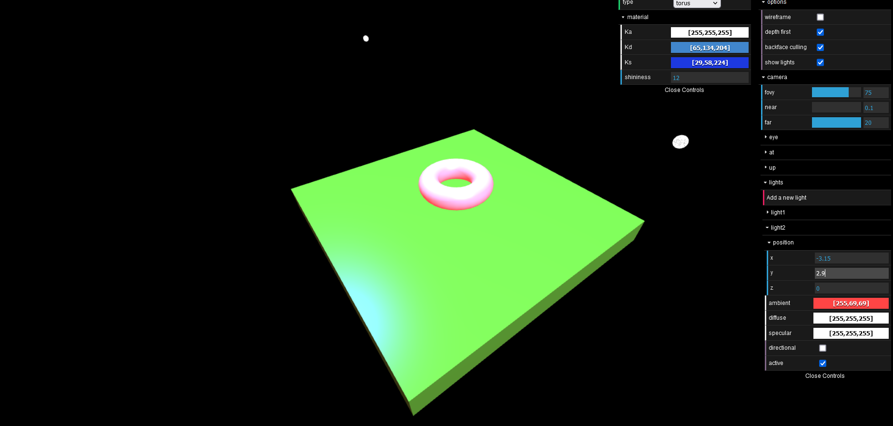

# Prespectives and light

Has a tab menu to change prespective, object shape and color, add and remove lights, and so on.  
_tip:_ drag mouse up and down when clicling position fields to move camera/light.

## Running
Clone, or check [here](https://maria-contins.github.io/PrespectiveAndLight/)!

## Made with:
* [**Cláudio Guerra**](https://github.com/claudiofcguerra)
